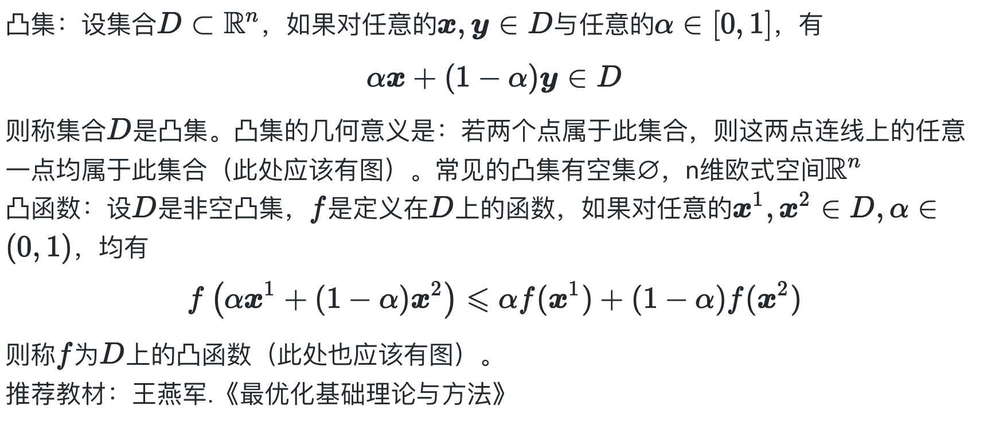

1. ⽼板给了你⼀个关于癌症检测的数据集，你构建了⼆分类器然后计算了准确率为 98%， 你是否对这个模型很满意？为什么？如果还不算理想，接下来该怎么做？

   首先模型主要是找出患有癌症的患者，模型关注的实际是坏样本。其次一般来说癌症的数据集中坏样本比较少，正负样本不平衡。

   准确率指的是分类正确的样本占总样本个数的比率
   $$
   \text { Accuracy }=\frac{n_{\text {correct }}}{n_{\text {total }}}
   $$
   其中$n_{correct}$为正确分类样本的个数，$n_{total}$为总样本分类的个数。

   当好样本(未患病)的样本数占99%时，模型把所有的样本全部预测为好样本也可以获得99%的准确率，所以当正负样本非常不平衡时，准确率往往会偏向占比大的类别，因此这个模型使用准确率作为模型的评估方式并不合适。

   鉴于模型关注的实际是坏样本，建议使用召回率(Recall )作为模型的评估函数。

   Recall 是分类器所预测正确的正样本占所有正样本的比例，取值范围为[0,1]，取值越大，模型预测能力越好。
   $$
   R=\frac{TP}{TP+FN}  
   $$

   其次，使用类别不平衡的解决方案：

   常见的处理数据不平衡的方法有：重采样、Tomek links、SMOTE、NearMiss等

   除此之外：还可以使用模型处理：使用多种树模型算法，使用多种重采样的训练集，对少数样本预测错误增大惩罚，避免使用Accuracy，可以用confusion matrix，precision，recall，f1-score，AUC，ROC等指标。

   

2. 怎么判断⼀个训练好的模型是否过拟合？ 如果判断成了过拟合，那通过什么办法 可以解决过拟合问题？

   模型在验证集合上和训练集合上表现都很好，而在测试集合上变现很差。

   解决过拟合的办法：

   - 特征降维

   - 添加正则化，降低模型的复杂度

   - Dropout

   - Early stopping

   - 交叉验证

   - 决策树剪枝

   - 选择合适的网络结构

   

3. 对于线性回归，我们可以使⽤ Closed-Form Solution, 因为可以直接把导数设置 为 0，并求出参数。在这个 Closed-Form ⾥涉及到了求逆矩阵的过程，什么时候不能求出其逆矩阵？这时候如何处理？

   - 什么是闭式解(Closed-Form Solution)

     解析解(Analytical solution) 就是根据严格的公式推导，给出任意的自变量就可以求出其因变量，也就是问题的解，然后可以利用这些公式计算相应的问题。所谓的解析解是一种包含分式、三角函数、指数、对数甚至无限级数等基本函数的解的形式。用来求得解析解的方法称为解析法(Analytical techniques)，解析法即是常见的微积分技巧，例如分离变量法等。解析解是一个封闭形式(Closed-form) 的函数，因此对任一自变量，我们皆可将其带入解析函数求得正确的因变量。因此，解析解也被称为封闭解(Closed-form solution)。

     数值解(Numerical solution) 是采用某种计算方法，如有限元法， 数值逼近法，插值法等得到的解。别人只能利用数值计算的结果，而不能随意给出自变量并求出计算值。当无法藉由微积分技巧求得解析解时，这时便只能利用数值分析的方式来求得其数值解了。在数值分析的过程中，首先会将原方程加以简化，以利于后来的数值分析。例如，会先将微分符号改为差分（微分的离散形式）符号等，然后再用传统的代数方法将原方程改写成另一种方便求解的形式。这时的求解步骤就是将一自变量带入，求得因变量的近似解，因此利用此方法所求得的因变量为一个个离散的数值，不像解析解为一连续的分布，而且因为经过上述简化的操作，其正确性也不如解析法可靠。

     简而言之，解析解就是给出解的具体函数形式，从解的表达式中就可以算出任何对应值；数值解就是用数值方法求出近似解，给出一系列对应的自变量和解。

     参考：https://blog.csdn.net/weicao1990/article/details/90742414

   - 什么时候不能求出其逆矩阵

     满秩矩阵或者方阵才有逆矩阵，当一个矩阵不满秩，在对角线上存在为0的特征值，求逆的时候$\frac{1}{0}$无法计算从而不可逆，那我们给它加上一个单位矩阵，这样它就不为0了，

     求解的时候加上单位矩阵其实就是对线性回归引入正则化的过程

     参考：https://zhuanlan.zhihu.com/p/44612139

   

4. 关于正则，我们⼀般采⽤ L2 或者 L1, 这两个正则之间有什么区别？ 什么时候需要⽤ L2， 什么时候需要⽤ L1?

   L1正则化（也叫Lasso回归）是在目标函数中加上与系数的绝对值相关的项，而L2正则化（也叫岭回归）则是在目标函数中加上与系数的平方相关的项。

   Lasso 和岭回归系数估计是由椭圆和约束函数域的第一个交点给出的。因为岭回归的约束函数域没有尖角，所以这个交点一般不会产生在一个坐标轴上，也就是说岭回归的系数估计全都是非零的。然而，Lasso 约束函数域在每个轴上都有尖角，因此椭圆经常和约束函数域相交。发生这种情况时，其中一个系数就会等于 0。

   L2正则化会使参数的绝对值变小，增强模型的稳定性（不会因为数据变化而产生很大的震荡）；而L1正则化会使一些参数为零,可以实现特征稀疏, 增强模型解释性。

   参考：https://blog.csdn.net/zouxy09/article/details/24971995/

5. 正则项是否是凸函数？请给出证明过程。

   相关概念：凸集，凸函数

   

   

   因此证明正则项是否是凸函数，需要证明：

   1. $f(\boldsymbol{x})$  在 $D$ 上二阶连续可微

   2. $f(\boldsymbol{x}) $的Hessian(海塞)矩阵在 $D$上是半正定 

   3. 半正定矩阵的判定定理之一：若实对称矩阵的所有顺序主子式均为非负，则该矩阵为半 正定矩阵。

      参考：https://www.bilibili.com/video/BV1Mh411e7VU?p=2

6. 什么叫 ElasticNet? 它主要⽤来解决什么问题？ 具体如何去优化？

   弹性回归是岭回归和lasso回归的混合技术，它同时使用 L2 和 L1 正则化。当有多个相关的特征时，弹性网络是有用的。lasso回归很可能随机选择其中一个，而弹性回归很可能都会选择。
   $$
   \hat{\beta}=\underset{\beta}{\operatorname{argmin}}\left(\|y-X \beta\|^{2}+\lambda_{2}\|\beta\|^{2}+\lambda_{1}\|\beta\|_{1}\right)
   $$

   - 在高度相关变量的情况下，它支持群体效应。
   - 它对所选变量的数目没有限制
   - 它具有两个收缩因子 λ1 和 λ2。

   参考：https://www.zhihu.com/search?type=content&q=ElasticNet

7. 基于 Coordinate Descent 算法给出 LASSO 的优化推导过程。

   参考：https://www.cnblogs.com/zzqingwenn/p/10874522.html

8. 请推导逻辑回归模型： ⽬标函数的构建，最优解的求解过程（SGD）需要详细写出。

9. 在数据线性可分的情况下，为什么逻辑回归模型的参数会变得⽆穷⼤？怎么避免？

10. 逻辑回归是线性还是⾮线性模型？ 为什么？ 请给出推导过程。

   logistic回归属于线性模型还是非线性模型？ - 泰克尼客的回答 - 知乎 https://www.zhihu.com/question/30726036/answer/532532312

11. 我们在使⽤逻辑回归模型的时候，通常把连续性变量切分成离散型变量，为什么？ 有什么好处？

12. 朴素⻉贝叶斯应为叫 Naïve Bayes, 请说出朴素⻉贝叶斯模型的构建过程以及预测过程， 并说出为什么叫“naive”?

13. 什么叫⽣成模型，什么叫判别模型？ 朴素⻉贝叶斯，逻辑回归，HMM，语⾔模型 中哪⼀个是⽣成模型，哪⼀个是判别模型？

14. 决策树与随机森林的区别是什么？ 如果让你选择，你会使⽤哪个模型，为什么？

15. 请介绍 k-means 算法的流程， 写出 k-means 模型的⽬标函数。K-means 求解 过程跟 EM 算法之间有什么关系？ K-MEANS ⽬标函数是否是 convex?

16. 什么叫 EM 算法？有哪些经典模型的求解过程会⽤到 EM 算法？

17. EM 算法是否⼀定会收敛？EM 算法给出的全局最优还是局部最优？

18. 请解释什么叫 MLE，什么叫 MAP? 请说明它们之间的区别。 在数据量⽆穷多的 时候，是否 MAP 趋近于 MLE 估计？

19. 请解释什么叫召回率，精确率，F1 Measure，ROC, AUC? 什么时候需要⽤到这 些？

20. 数据集拥有⾮常多的特征，但样本个数有限，所以计划做特征选择，有哪些⽅法 可以⽤来做特征选择呢？

21. 随机森林和 Gradient Boosting Tree 之间的区别是什么？

22. 在构建决策树模型的时候，我们⼀般不会构建到底，也就做⼀些剪枝的操作，为 什么？ 然⽽，在构建随机森林的时候剪枝的操作不像决策树⾥那么重要，为什么？

23. 什么样的数据是不均衡数据（imbalance data）？ 需要怎么样的处理？

24. 什么是 kernel trick? 它有什么好处？并写出 RBF kernel, Gaussian Kernel 的公 式。

25. 什么 Mercer’s Theorem， 阐述⼀下具体的细节。

26. 使⽤⾮线性 Kernel 有哪些优缺点？重点介绍⼀下效率上的缺点，并说明为什么会 产⽣效率上的缺点？

27. SVM 是 margin-based classifier, 试着推导 SVM，并说明什么是 KKT 条件。

28. 如果不考虑 kernel， 逻辑回归和 SVM 的区别是什么？

29. 在随机梯度下降法⾥怎么有效地选择学习率?有哪些常⻅见的动态改变学习率的策略？

30. 深度学习是什么？ 它跟所谓的传统的学习模型有什么本质的区别？从模型的 Capacity, Hierarchical Representation 的⻆角度举例说明。

31. PCA 的原理是什么？ 推导⼀下 PCA 的过程。

32. 什么叫 PAC 理论？ 它主要⽤来解决什么问题？

33. 解释⼀下矩阵分解算法以及怎么⽤到推荐系统⾥，并利⽤梯度下降法来推导矩阵 分解过程。

34. 模型参数和超参数的区别是什么？

    参考：https://mp.weixin.qq.com/s/Nwd0Dm2_D1eY3n4z_Fw1FA

35. 什么叫因变量，以及因变量模型？

36. 超参数的选择⽅法有哪些？⾄少列出 4 种以上来说明，并说出其优缺点。

37. 什么是 XGBoost 模型？说明⼀下其技术细节。

38. 怎么把 K-means 算法应⽤到⼤规模的数据上？ 有什么 Scalable 的⽅法？(hint:mini-batch, triangle inequality)

39. K-means 算法与 GMM 之间有什么关系？

40. 在深度学习模型⾥，有哪些技术可以⽤来避免过拟合现象？

41. CNN ⾥⾯ POOLING 的作⽤是什么？ 卷积的作⽤是什么？

42. 在分类问题⾥，最后⼀层通常使⽤ softmax，请写 softmax 函数。

43. 描述⼀下 SGD, Adagrad, Adam 算法之间的区别，什么时候使⽤ SGD？ Adagrad？ Adam 算法？

44. 简 单 描 述 ⼀ 下 什 么 是 Variational Autoencoder(VAE), 什 么 是 Generative Adversial Network(GAN)

45. Dropout 和 Bagging 模型的关系是什么？ 为什么 Dropout 可以起到避免过拟合 的作⽤？

46. 对于拥有两层隐含层的神经⽹络（MLP）, 请⼿动推导其 BP 算法的细节。

47. 使⽤ KNN 会遇到⼀些效率上的问题，请说明如何使⽤ LSH（latent semantic hashing）来做近似操作？

48. 在朴素⻉贝叶斯和语⾔模型中我们通常会使⽤ smoothing 技术，请简述⼏个常⻅见 的 smoothing ⽅法以及它们优缺点。

    参考：https://mp.weixin.qq.com/s?__biz=MzA3NjIyOTk4OA==&mid=2247484173&idx=1&sn=02f133259224c86dd5f573f226e7f0a7&scene=19#wechat_redirect